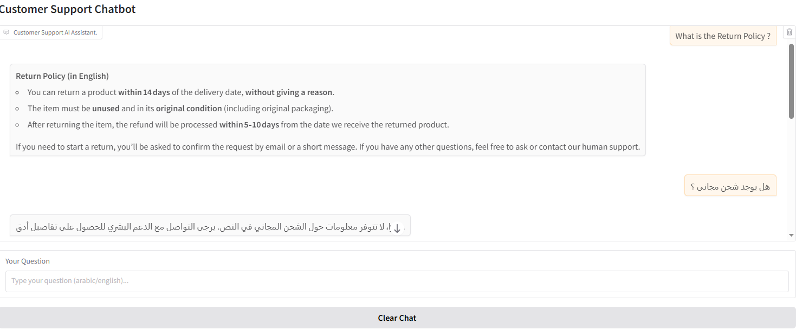

# 📞 Customer Support Chatbot (Regular RAG)

AI-powered Customer Support Chatbot built using **Regular Retrieval-Augmented Generation (RAG)** to answer customer questions based on company documentation.

The chatbot retrieves relevant information from a PDF knowledge base and generates accurate responses using a large language model.

---

## 📸 Demo



## 🚀 Project Overview

This project implements a **Customer Support AI Assistant** for an electronics company.

It works by:

1. Loading company documentation (PDF)
2. Splitting it into chunks
3. Converting chunks into embeddings
4. Storing them inside a vector database (Chroma)
5. Retrieving the most relevant chunks for each user query
6. Generating a response using an LLM
7. Providing a simple Gradio chat interface

The chatbot:

* Responds in **Arabic or English**
* Uses only information from the knowledge base
* Avoids hallucination
* Suggests contacting human support if info is missing

---

# 🧠 Architecture (Regular RAG Pipeline)

```
User Question
      ↓
Retriever (Chroma Vector DB)
      ↓
Top-K Relevant Chunks
      ↓
Prompt Template
      ↓
LLM (Groq - openai/gpt-oss-120b)
      ↓
Final Answer
```

---

# 🛠️ Tech Stack & Tools Used

### 🔹 Core Framework

* LangChain
* LangChain Community
* LangChain Core

### 🔹 Embeddings

* HuggingFaceEmbeddings
* Model: `intfloat/multilingual-e5-small`

### 🔹 Vector Database

* Chroma (Persistent Storage)

### 🔹 Document Loader

* PyPDFLoader

### 🔹 Text Splitting

* RecursiveCharacterTextSplitter

### 🔹 LLM Provider

* Groq API
* Model: `openai/gpt-oss-120b`

### 🔹 Interface

* Gradio

### 🔹 Environment

* Google Colab
* Google Drive (for PDF + Vector DB persistence)

---

# 📂 Project Structure

```
.
├── Customer_Support_Chatbot[RAG].ipynb
├── customer_support_arabic_full.pdf
├── chroma_customer_support/
└── README.md
```

---

# ⚙️ How It Works

## 1️⃣ Load PDF Knowledge Base

The chatbot loads:

```python
PyPDFLoader(PDF_PATH)
```

---

## 2️⃣ Split into Chunks

Using:

```python
RecursiveCharacterTextSplitter(
    chunk_size=500,
    chunk_overlap=100
)
```

This improves retrieval accuracy.

---

## 3️⃣ Create Embeddings

Using multilingual embedding model:

```
intfloat/multilingual-e5-small
```

Supports both Arabic and English.

---

## 4️⃣ Store in Chroma Vector DB

If database exists → Load it
If not → Build from scratch and persist to Drive

---

## 5️⃣ Retrieval Strategy

Using:

```
search_type = "mmr"
k = 6
fetch_k = 10
```

MMR helps reduce redundancy and improve answer quality.

---

## 6️⃣ LLM Generation

Using Groq-hosted model:

```
openai/gpt-oss-120b
```

Temperature: `0.2` (to reduce randomness)

---

## 7️⃣ Gradio Chat Interface

Simple web-based UI:

* Chat window
* Clear button
* Multi-language support

---

# ▶️ How to Run the Project

## Step 1: Install Dependencies

```bash
pip install langchain langchain-community langchain-groq langchain-core langchain-chroma
pip install pypdf
pip install gradio
```

---

## Step 2: Set Environment Variable

You must set your Groq API key:

```python
os.environ["GROQ_API_KEY"] = "YOUR_API_KEY"
```
- Must use Google Colab Secrets.

---

## Step 3: Upload Knowledge Base

Place your PDF file inside Google Drive and update:

```python
PDF_PATH = "your_pdf_path"
CHROMA_DIR = "your_chroma_directory"
```

---

## Step 4: Run the Notebook

Execute all cells.

Gradio will launch a public link like:

```
https://xxxxx.gradio.live
```

Open it and start chatting.

---

# 💡 How Users Can Benefit From This Project

* Automate customer support
* Reduce human workload
* Answer FAQs instantly
* Support Arabic & English users
* Prevent hallucinated answers
* Easy to extend to other industries

---

# 🔒 Hallucination Control

The system prompt enforces:

* Use ONLY provided context
* If information missing → say “I don’t know”
* Suggest contacting human support

This makes it production-safe for support environments.

---

---

# 🧪 Example Questions

* What is the warranty period?
* How can I return a product?
* Do you offer international shipping?
* How do I reset the device?
* or any question in arabic 

# 🏁 Final Notes

This project demonstrates:

* Practical RAG implementation
* Real-world multilingual retrieval
* Persistent vector database usage
* Production-style prompt engineering
